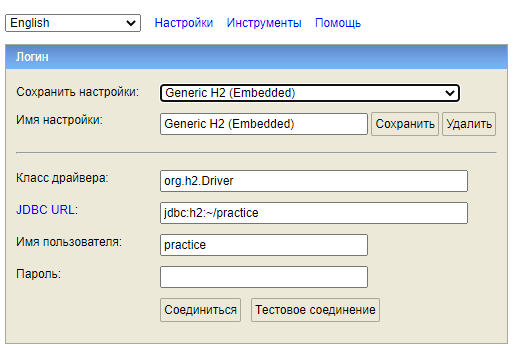

<body>
<h2>API working with organization information</h2>
<h5>С помощью данного API можно осуществлять:</h5>
<ul>
<li>Добавление (организации/офиса/сотрудника)</li>
<li>Изменение по заданным критериям (организации/ офиса/ сотрудника) </li>
<li>Получение по заданному идентификатору (организации/ офиса/ сотрудника)</li>
<li>Получение отфильтрованного списка (организаций/ офисов/ сотрудников)</li>
<li>Получение списка из справочников (тип документа/ страны)</li>
</ul>
<h5>Установка и запуск приложения:</h5>
<ol>
<li>Скачать проект</li>
<li>Разархивировать</li>
<li>Добавить проект в IDEA</li>
<li>Настроить базу данных
<ul>
<li>Скачать базу данных H2 c сайта: <a>http://www.h2database.com/html/download.html</a></li>
<li>Установить</li>
<li>Запустить H2 Console</li>
<li>Сделать конфигурацию по скриншоту:

</li>
<li>Нажать соединиться</li>
</ul>
<li>Запустить программу с помощью ru.bellintegrator.practice.PracticeApplication.java</li>
<li>Адрес для взаимодействия с API по умолчанию: http://localhost:8080</li>
<li>Добавлен Swagger UI, адрес для взаимодействия: http://localhost:8080/swagger-ui.html</li>
</ol>
</body>
