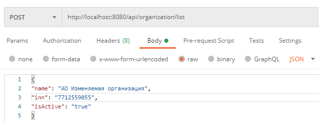
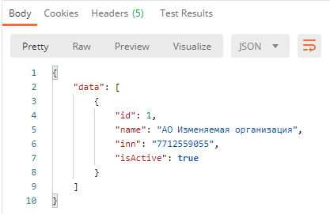
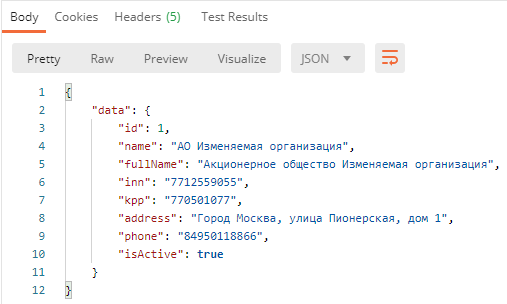
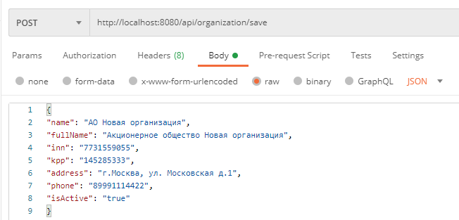
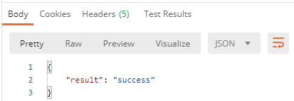
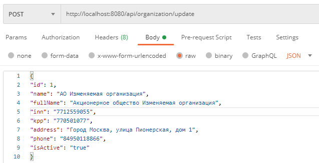

# StudyProjectBell

<body>
<h2>Учебный проект Bell Integrator SpringBoot API:</h2>
<h5>С помощью данного API можно осуществлять:</h5>
<ul>
<li>Добавление (организации/офиса/сотрудника)</li>
<li>Изменение по заданным критериям (организации/ офиса/ сотрудника) </li>
<li>Получение по заданному идентификатору (организации/ офиса/ сотрудника)</li>
<li>Получение отфильтрованного списка (организаций/ офисов/ сотрудников)</li>
<li>Получение списка из справочников (тип документа/ страны)</li>
</ul>
<h5>Установка и запуск приложения:</h5>
<ol>
<li>Скачать проект</li>
<li>Разархивировать</li>
<li>Добавить проект в IDEA</li>
<li>Настроить базу данных
<ul>
<li>Скачать базу данных H2 c сайта: <a>http://www.h2database.com/html/download.html</a></li>
<li>Установить</li>
<li>Запустить H2 Console</li>
<li>Сделать конфигурацию по скриншоту:

</li>
<li>Нажать соединиться</li>
</ul>
<li>Запустить программу с помощью ru.bellintegrator.practice.PracticeApplication.java</li>
<li>Адрес для взаимодействия с API по умолчанию: <a>localhost:8080</a></li>
<li>В качестве клиента к API можем использовать: "Postman API Client"</li>
</ol>

<h3>Описание запросов API:</h3>
<h5>Cписок запросов для организации</h5>
<ul>
<li>

Для получение отфильтрованного списка организаций нужно отправить POST запрос c параметрами фильтра в виде JSON на адрес: <a>http://localhost:8080/api/organization/list</a>

Тело запроса содержащее:

<ul>
<li>"name" - имя организации (обязательный параметр)</li>
<li>"inn" - индивидуальный налоговый номер организации</li>
<li>"isActive" - статус организации</li>
</ul>

<li>

Для получения организации по заданному идентификатору нужно отправить GET запрос c id на адрес: <a>http://localhost:8080/api/organization/{id}</a>

<ul>
  <li>Параметр запроса id</li>
</ul>

<li>
Для добавления новой организации нужно отправить POST запрос c информацией об организации в виде JSON на адрес: <a>http://localhost:8080/api/organization/save</a>

Тело запроса содержащее:

<ul>
<li>"name" - имя организации (обязательный параметр)</li>
<li>"fullName" - полное имя организации (обязательный параметр)</li>
<li>"inn" - индивидуальный налоговый номер организации (обязательный параметр)</li>
<li>"kpp" - код причины постановки организации (обязательный параметр)</li>
<li>"address" - адрес организации (обязательный параметр)</li>
<li>"phone" - телефон организации</li>
<li>"isActive" - статус организации</li>
</ul>

<li>
Для изменения данных организации нужно отправить POST запрос c информацией об организации в виде JSON на адрес: <a>http://localhost:8080/api/organization/update</a>

Тело запроса содержащее:

<ul>
<li>"id" - идентификатор изменяемой организации (обязательный параметр)</li>
<li>"name" - имя организации (обязательный параметр)</li>
<li>"fullName" - полное имя организации (обязательный параметр)</li>
<li>"inn" - индивидуальный налоговый номер организации (обязательный параметр)</li>
<li>"kpp" - код причины постановки организации (обязательный параметр)</li>
<li>"address" - адрес организации (обязательный параметр)</li>
<li>"phone" - телефонный номер организации</li>
<li>"isActive" - статус организации</li>
</ul>
</ul>

<h5>Cписок запросов для офисов</h5>
<ul>
<li>

Для получение отфильтрованного списка офисов нужно отправить POST запрос c параметрами фильтра в виде JSON на адрес: <a>http://localhost:8080/api/office/list</a>

Тело запроса содержащее:

<ul>
<li>"organizationId" - идентификатор организации к которой принадлежит офис (обязательный параметр)</li>
<li>"name" - имя офиса</li>
<li>"phone" - телефонный номер офиса</li>
<li>"isActive" - статус офиса</li>
</ul>

<li>

Для получения офиса по заданному идентификатору нужно отправить GET запрос c id на адрес: <a>http://localhost:8080/api/office/{id}</a>

<ul>
  <li>Параметр запроса id</li>
</ul>

<li>
Для добавления нового офиса нужно отправить POST запрос c информацией об офисе в виде JSON на адрес: <a>http://localhost:8080/api/office/save</a>

Тело запроса содержащее:

<ul>
<li>"organizationId" - идентификатор организации к которой принадлежит офис (обязательный параметр)</li>
<li>"name" - имя офиса</li>
<li>"address" - адрес офиса </li>
<li>"phone" - телефонный номер офиса</li>
<li>"isActive" - статус офиса</li>
</ul>

<li>
Для изменения данных офиса нужно отправить POST запрос c информацией об офисе в виде JSON на адрес: <a>http://localhost:8080/api/office/update</a>

Тело запроса содержащее:

<ul>
<li>"id" - идентификатор изменяемого офиса (обязательный параметр)</li>
<li>"name" - имя офиса</li>
<li>"address" - адрес офиса </li>
<li>"phone" - телефонный номер офиса</li>
<li>"isActive" - статус офиса</li>
</ul>
</ul>

<h5>Cписок запросов для сотрудников</h5>
<ul>
<li>

Для получение отфильтрованного списка сотрудников нужно отправить POST запрос c параметрами фильтра в виде JSON на адрес: <a>http://localhost:8080/api/user/list</a>

Тело запроса содержащее:

<ul>
<li>"officeId" - идентификатор офиса в котором работает сотрудник (обязательный параметр)</li>
<li>"firstName" - имя сотрудника</li>
<li>"middleName" - отчество сотрудника</li>
<li>"lastName" - фамилия сотрудника</li>
<li>"position" - должность сотрудника</li>
<li>"documentCode" - код документа удостоверяющего личность</li>
<li>"citizenShipCode" - код страны, которой сотрудник является гражданином</li>
</ul>

<li>

Для получения сотрудника по заданному идентификатору нужно отправить GET запрос c id на адрес: <a>http://localhost:8080/api/user/{id}</a>

<ul>
  <li>Параметр запроса id</li>
</ul>

<li>
Для добавления нового сотрудника нужно отправить POST запрос c информацией о сотруднике в виде JSON на адрес: <a>http://localhost:8080/api/user/save</a>

Тело запроса содержащее:

<ul>
<li>"officeId" - идентификатор офиса в котором работает сотрудник (обязательный параметр)</li>
<li>"firstName" - имя сотрудника (обязательный параметр)</li>
<li>"middleName" - отчество сотрудника</li>
<li>"lastName" - фамилия сотрудника</li>
<li>"position" - должность сотрудника (обязательный параметр)</li>
<li>"phone" - телефонный номер сотрудник</li>
<li>"documentCode" - код типа документа удостоверяющего личность</li>
<li>"documentName" - название документа удостоверяющего личность</li>
<li>"documentNumber" - номер документа удостоверяющего личность</li>
<li>"documentDate" - дата выдачи документа удостоверяющего личность</li>
<li>"citizenShipCode" - код страны, которой сотрудник является гражданином</li>
<li>"isIdentified" - идентифицирован ли сотрудник</li>
</ul>

<li>
Для изменения данных сотрудника нужно отправить POST запрос c информацией о сотруднике в виде JSON на адрес: <a>http://localhost:8080/api/user/update</a>

Тело запроса содержащее:

<ul>
<li>"id" - идентификатор изменяемого сотрудника (обязательный параметр)</li>
<li>"officeId" - идентификатор офиса в котором работает сотрудник </li>
<li>"firstName" - имя сотрудника (обязательный параметр)</li>
<li>"middleName" - отчество сотрудника</li>
<li>"lastName" - фамилия сотрудника</li>
<li>"position" - должность сотрудника (обязательный параметр)</li>
<li>"phone" - телефонный номер сотрудник</li>
<li>"documentName" - название документа удостоверяющего личность</li>
<li>"documentNumber" - номер документа удостоверяющего личность</li>
<li>"documentDate" - дата выдачи документа удостоверяющего личность</li>
<li>"citizenShipCode" - код страны, которой сотрудник является гражданином</li>
<li>"isIdentified" - идентифицирован ли сотрудник</li>
</ul>
</ul>

<h5>Cписок запросов для справочников</h5>
<ul>
<li>

Для получения справочной информации по типам документов нужно отправить GET запрос на адрес: <a>http://localhost:8080/api/docs</a>

</li>
<li>

Для получения справочной информации по странам нужно отправить GET запрос на адрес: <a>http://localhost:8080/api/countries</a>

</li>
</ul>

<h4>Примеры запросов для организации:</h4>
<ul>
<li>

Для получение отфильтрованного списка организаций нужно отправить POST запрос c параметрами фильтра в виде JSON на адрес: <a>http://localhost:8080/api/organization/list</a>

Ответ на запрос:

</li>
<li>

Для получения организации по заданному идентификатору нужно отправить GET запрос c id на адрес: <a>http://localhost:8080/api/organization/{id}</a>

Ответ на запрос:

</li>
<li>

Для добавления новой организации нужно отправить POST запрос c информацией об организации в виде JSON на адрес: <a>http://localhost:8080/api/organization/save</a>

Ответ на запрос:

</li>

<li>

Для изменения организации нужно отправить POST запрос c информацией об организации в виде JSON на адрес: <a>http://localhost:8080/api/organization/update</a>

Ответ на запрос:

</li>
</ul>
</body>
